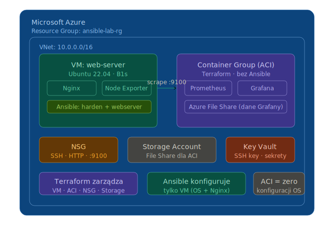

# Azure IAC Lab

This repository contains Infrastructure as Code (IaC) configurations for Azure resources using Terraform and Ansible.

## Architecture

## TODO

### High Priority

- [ ] Implement proper monitoring and logging for container instances
- [ ] Add health checks for Grafana and Prometheus services
- [ ] Configure Azure Monitor integration
- [ ] Set up automated backups for persistent data
- [X] Add Grafana credentials from KeyVault
- [ ] Add WireGuard VPN for VM via Ansible

### Medium Priority

- [ ] Add SSL/TLS certificates for Grafana
- [ ] Implement proper networking security groups
- [ ] Add resource tagging strategy
- [ ] Create deployment pipelines with GitHub Actions

